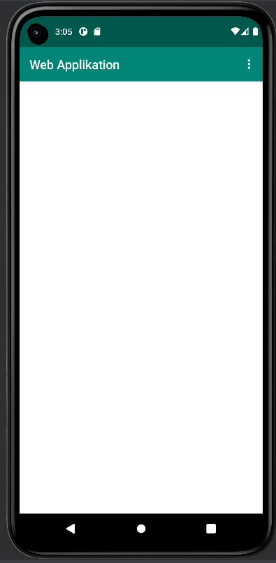
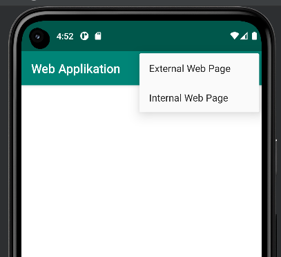
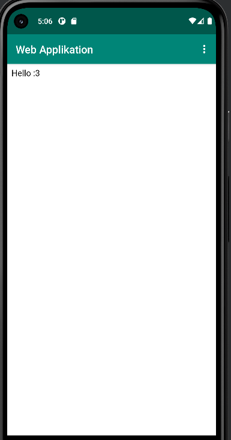
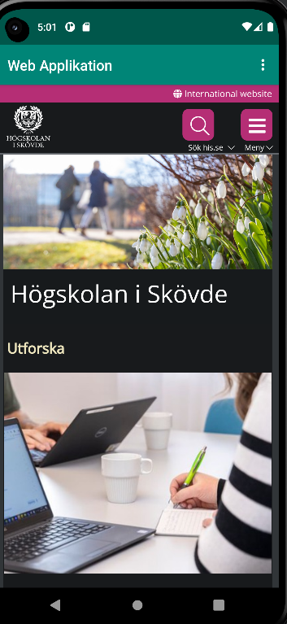

Rapport - WebView

Denna rapport innefattar några olika delar som har använts för att kunna skapa element och 
funktioner i mobilappen. 

En utav de första ändringarna som gjordes var att byta appens namn. Detta utfördes inom strings.xml filen, där <string name="app_name"> fick det nya namnet Web Applikation tilldelat som kan ses i kodsnutten nedan.
        
        <resources>
            <string name="app_name">Web Applikation</string>
            ...
        </resources>
    

Det nya utseendet för appens namn ses i följande bild: 

För att kunna få tillgång till internet lades kodstycket <uses-permission android:name="android.permission.INTERNET" /> in i filen AndroidManifest.xml, och kan ses som följande i kodsnutten under. 

    <?xml version="1.0" encoding="utf-8"?>
    <manifest xmlns:android="http://schemas.android.com/apk/res/android"
    package="com.example.webviewapp">
        <uses-permission android:name="android.permission.INTERNET" />
        ...
    </manifest>

Nästa del i bygget av appen var att skapa ett WebView element, samt tilldela denna ett id. För att göra detta byttes TextView ut och WebView skrevs istället på
samma plats. Koden nedan finns i filen activity_main.xml och har ett WebView element, där raden android:id="@+id/my_webview" befinner sig inom denna och ger WebView id "my_webview".

        <WebView
            android:id="@+id/my_webview"
            .../>
    </androidx.constraintlayout.widget.ConstraintLayout>

För att kunna skapa en private member variable sattes private WebView myWebView; in i filen MainActivity.java som kan ses i kodsnutten nedanför. Private WebView myWebView; 
innebär att det är en private member variable av typen WebView med namnet myWebView. Genom att sätta in myWebView = findViewById(R.id.my_webview); under onCreate(), 
kopplas variabeln myWebView till WebView elementet då denna har id my_webview. 

    public class MainActivity extends AppCompatActivity {
    
        private WebView myWebView;
    
        ...
    
        @Override
        protected void onCreate(Bundle savedInstanceState) {
        ...
    
            myWebView = findViewById(R.id.my_webview);
            myWebView.setWebViewClient(new WebViewClient());
            WebSettings webSettings = myWebView.getSettings();
            webSettings.setJavaScriptEnabled(true);
        ...

Vid skapandet av en ny WebViewClient utfördes i samma fil (MainActivity.java), där strängen med kod nedan implementerades i samma kodblock som det precis ovan. 

        myWebView.setWebViewClient(new WebViewClient());

För att kunna utföra diverse JavaScript funktioner tillämpades detta med följande kod som uttrycker att JavaScriptEnabled(true), vilket innebär att JavaScript tillåts. 

        WebSettings webSettings = myWebView.getSettings();
        webSettings.setJavaScriptEnabled(true);

I assets mappen skapades en ny html fil (index.html) som är gjord för att visas när den interna hemsidan visas med hjälp av showInternalWebPage(){. För att visa den externa 
webbsidan används showExternalWebPage(){, och kan ses i större helhet i kodblocket nedan. Detta kodstycke befinner sig i filen MainActivity.java. 

        public void showExternalWebPage(){
            myWebView.loadUrl("https://his.se");
        }
        
        public void showInternalWebPage(){
            myWebView.loadUrl("file:///android_asset/index.html");
        }

Den nedanstående koden är sammanhängande till dropdown menyn på startsidan. Med detta kan brukaren välja ifall en vill se den interna eller den externa webbsidan.
När användaren väljer External Webpage visas his.se, och när en väljer Internal Webpage visas den skapade index.html sidan. 

        @Override
        public boolean onOptionsItemSelected(MenuItem item) {
            
            int id = item.getItemId();
    
            if (id == R.id.action_external_web) {
                showExternalWebPage();
                Log.d("==>","Will display external web page");
                return true;
            }
    
            if (id == R.id.action_internal_web) {
                showInternalWebPage();
                Log.d("==>","Will display internal web page");
                return true;
            }
    
            return super.onOptionsItemSelected(item);
        }
    }

Ovan finns bild för dropdown meny. 

Ovan finns en bild på den interna webbsidan. 

Ovan finns en bild på den externa webbsidan. 

,,,](android.png)

